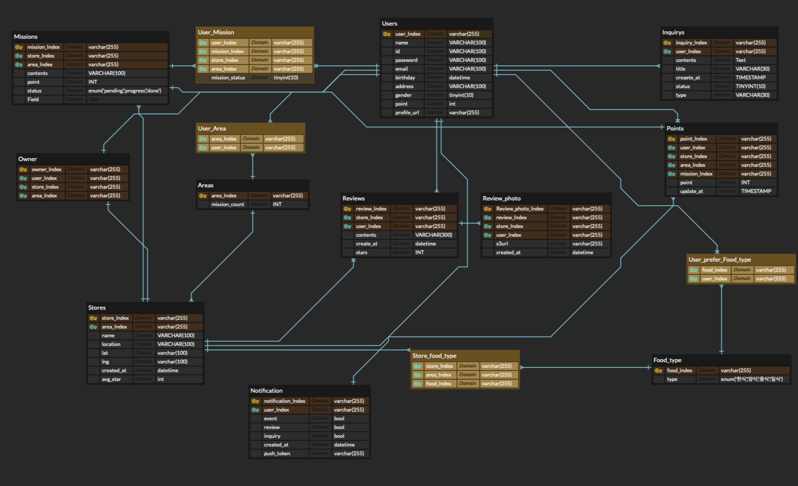

* [ ] 일반(주니어) 미션에서 제외되었던 부분까지 ERD를 설계해 주세요. 지도 검색, 내 포인트 관리, 알림, 사장님의 자신의 점포 관리하는 부분이 포함됩니다.
  * 어떻게 설계하였는지 간단하게 정리하여 주세요. ERD 자체를 첨부해 주셔도 좋습니다.
* [ ] 미션 자료로 제공된 피그마를 보고 ERD를 설계한 후 제 1,2,3 정규화를 통해 제 1,2,3 정규형을 만들고 각각 중복된 데이터가 어떻게 변화하였고 어떠한 이점이 있었는 지 작성하여 주세요
  * 내용들을 간단하게 정리하여 주세요

    ## **1 제1정규형(1NF) – 원자값과 반복 그룹 제거**

    **원칙:** 모든 속성은 원자적, 반복 그룹은 별도 릴레이션으로 분리

    * **알림 설정의 반복 속성 분리**
      * BEFORE: Notification(event BOOL, review BOOL, inquiry BOOL, push_token)
      * AFTER:
        * notification_type(code='EVENT_NEW','REVIEW_REPLY','INQUIRY_REPLY' ...)
          : 유형이 늘면 컬럼 추가가 아니라 **행(row)**만 추가, 확장성↑, 스키마 변경 없이 새 알림 타입 추가
    * **포인트/미션/오너 등도 단일 PK 사용**
      * 복합 PK → 단일 *_id PK로 표준화
        : 조인 단순화, 인덱스 설계 용이, 부분 종속(2NF 위반) 사전 차단

    ## **2 제2정규형(2NF) – 부분 함수적 종속 제거**

    **원칙:** 복합 키의 “일부”에만 의존하는 속성 제거

    * **Reviews의 부분 종속 제거**
      * BEFORE: PK가 (review_Index, store_Index, user_Index)
        * contents, stars, created_at는 사실 review_Index에만 종속
      * AFTER: review_id 단일 PK, store_id, user_id는 FK
        : 하나의 리뷰에 대한 내용/별점이 **단일 키**에 종속되어 중복/모순 제거
    * **User_Mission의 부분 종속 제거**
      * BEFORE: PK (user, mission, store, area)
      * AFTER: user_mission_id 단일 PK + mission_id FK + (필요 시 store_id, area_id는 Mission에 이미 종속)
        **:** store/area 중복 컬럼 제거 가능(미션이 어느 점포/지역인지 Mission에 이미 있음), 데이터 무결성↑, 입력/갱신 단순화
    * **Points의 부분 종속 정리**
      * BEFORE: 복합 PK (point, user, store, area, mission)
      * AFTER: point_id 단일 PK + user_id, mission_id FK(그리고 store_id/area_id는 Mission에서 추론 가능하면 생략)
        **:** 포인트 적립 행이 **하나의 식별자**로 관리되어 회계 트랜잭션처럼 다루기 쉬움

    ## **3 제3정규형(3NF) – 이행 종속(Transitive) 제거**

    **원칙:** 키가 아닌 속성이 다른 속성에 의존하지 않도록

    * **Stores.avg_star(파생값) 분리**
      * BEFORE: Stores.avg_star
      * AFTER: StoreStats(store_id PK, review_count, avg_star, updated_at)
        **:** 리뷰 변경 때 마다 Stores의 avg를 갱신해야 했던 **갱신 이상** 사라짐, 쓰기 경합 줄고, 집계 갱신/비동기 처리 가능(물리화 뷰/배치)
    * **Owner의 area_id 중복 확인**
      * Owner(store_id, area_id)는 “점포가 속한 지역”과 같은 정보라면  **이행 종속** .
      * AFTER: Owner(user_id, store_id)만 저장하고 area_id는 조인으로 도출
        **:** 모순 데이터 방지(점포 지역 변경 시 Owner 모두 수정하는 이상 제거)
* [ ] 피그마의 홈 부분에서 한 사람이 “미션 도전!” 버튼을 빠르게 여러 번 눌렀을 때 여러 가지 이유(비동기 로직 등)로 요청이 지연되어 완전히 처리하기 전 두 번 요청이 들어갈 수 있습니다. 이를 해결할 수 있는 방법에 대해 작성하여 주세요 (ERD 직접적으로 관련이 있기보다는 설계할 때 한번쯤 고민해보면 좋을 것 추가시켜 놓았습니다) (다양한 방법이 있으니 찾아봐 주세요)
  * 내용들을 간단하게 정리하여 주세요
    밥 다 먹고 계산하고 돌아가려는데 와이파이 환경이나 단말기 성능의 문제로 요청이 느리게 전송 될 수 있다. 이러한 상황에서 미션 버튼을 여러번 눌러 진행중인 미션이 사라진다거나, 성공요청을 날렸는데 전송이 유실되는 불상사가 발생할 수 있다.
    일단 DB 관점에서 생각을 해보자

    1. Transaction 사용
       데이터의 정합성을 보장할 때 사용되는 가장 기본적인 방법이다. 미션관련한 쿼리에는 해당 쿼리가 반복되지 않았는지 DB에 기록하기 전에 중복을 체크하게 한다.
    2. 미션요청 Time Stamp 활용
       미션관련한 쿼리에는 Time Stamp를 추가해 DB에 기록하기 전에 너무 짧은 텀으로 여러번의 요청이 들어오면 이를 거부하거나 대기하도록 시킨다.

    아니면 다른 관점에서 생각 할 수도 있다.

    1. 최신요청 우선처리
       간단하게 생각했을 떄 아주 짧은시간(1~2분) 안에 여러가지 식당에서 밥을 먹고 미션을 완료했다고 볼 순 없을것이다. 따라서 여러번의 요청이 들어온다면 서버에서는 가장 최신의 요청만 수행하도록 하고 이전 요청은 무시하게 구현할 수 있다.
    2. 클라이언트 버튼 잠금
       한번 미션버튼을 누르면 의도적으로 로딩화면이나 대기화면을 띄워 이러한 문제를 원천적으로 차단하게 할 수도 있다.

