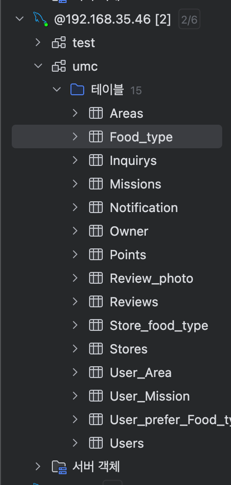
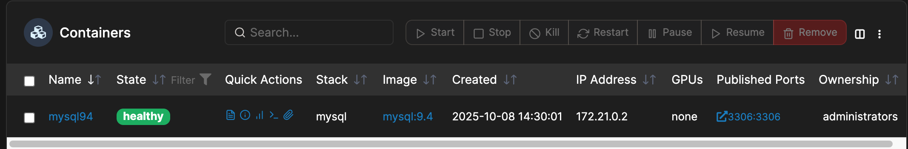

https://github.com/seoki180/9th_node_practice.git

# 시니어 미션

## ✅ 핵심 내용 1: ES6

### ▪ ES6란?

ES6는 JavaScript의 **2015년 ECMAScript 표준**을 의미하며, 공식적으로는 **ECMAScript 2015**라고도 불린다.
이전 버전에 비해 많은 새로운 기능과 문법이 추가되어 JavaScript 개발에 큰 변화를 가져왔다.

대표적인 기능들은 다음과 같다:

* `let`, `const` 키워드
* 화살표 함수 (Arrow Function)
* 템플릿 리터럴 (Template Literals)
* 디스트럭처링 할당 (Destructuring Assignment)
* 모듈 시스템 (import/export)
* 클래스 문법 (class)
* 프라미스 (Promise)

### ▪ 소프트웨어 아키텍처란?

소프트웨어 아키텍처는 시스템의 전반적인 구조와 설계 방식이다. 쉽게 말해서, 건물로 치면 건축 설계도 처럼. 어떤 기술을 쓸지, 어떤 방식으로 모듈을 나눌지, 컴포넌트 간에 어떻게 데이터를 주고받을지를 정의한것을 말한다.

아키텍처가 중요한 이유는 다음과 같다.

* 유지보수성 향상: 코드가 체계적으로 구성되어 있어 수정 및 확장이 용이.
* 협업 효율성: 역할 분리가 명확해 팀원 간 협업이 쉬움.
* 테스트 용이성: 레이어가 나뉘어 있어 단위 테스트가 간단.
* 재사용성 증가: 공통 로직이 재사용 가능한 구조로 분리됨.
* 스케일링 준비: 구조적으로 성장 가능한 코드 베이스 구축 가능.

---

## 🚨 미션 1 해결 과정

> ECMAScript의 의미, 그리고 ES6 이후에는 각 버전에 따라 어떤 기능들이 새로 추가되었는지 찾고 정리해주세요.

### ▪ ECMAScript란?

ECMA scrpit의 약자로 JS의 표준사양이다. ecma(European Computer Manufacturers Association)에서 1997년부터 표준화되어 관리하기 시작했다. ECMAScript는 구문(Syntax), 타입(Type), 문(statement), 키워드(keyword), 예약어(reserved words), 연산자(operator), 객체(object) 등 언어의 핵심적인 문법과 기능을 정의한다

### ▪ ES6 이후 주요 기능 정리

#### ✅ ES7 (2016)

* **지수 연산자 (`** `)**
* **Array.prototype.includes**

#### ✅ ES8 (2017)

* **async/await**
* **Object.entries / Object.values**

#### ✅ ES9 (2018)

* **for-await-of**
* **Promise.prototype.finally**

#### ✅ ES10 (2019)

* **Array.prototype.flat / flatMap**
* **Object.fromEntries**

#### ✅ ES11 (2020)

* **BigInt**
* **Optional Chaining (`?.`)**
* **Nullish Coalescing (`??`)**

#### ✅ ES12 (2021)

* **String.prototype.replaceAll**
* **Logical Assignment Operators (`&&=`, `||=`, `??=`)**

---

## 🚨 미션 2 해결 과정

> 워크북에서 소개한 프로젝트 아키텍처(Controller, Service, Data Access) 구조에 대해 더 정리하고, Data Access(DB) 레이어와의 결합도를 낮출 수 있는 구조를 고민해주세요.

### ▪ 기본 아키텍처 구성

* **Controller** : 클라이언트 요청을 받아 적절한 서비스 로직을 호출한다.
* **Service** : 비즈니스 로직을 처리한다.
* **Data Access (Repository)** : DB와의 직접적인 연결을 담당한다.

백엔드 아키텍처는 크게 3가지로 나눠진다.
클라이언트가 서비스를 요청한다 -> Controller가 해당 요청에 적합한 서비스 로직을 호출한다 -> Service에서 받은 서비스를 해결하고 필요할시 DB에 접근하기 위해 Repository에 접근한다 -> Repository는 DAO를 통해 DB와 통신하여 데이터를 받아온다

이때 Repository를 쓰는 이유는 뭘까?

1. 비지니스로직과 데이터접근로직을 분리하기위해
   SQL이나 DB접근을 Service에서 처리하면 유지보수와 재사용이 어렵다. 이때 Repositoy Layer를 통해 '어디서 어떻게 데이터를 가져오는지'를 숨기고 비지니스로직은 '무엇을 달라'에만 집중할 수 있다.
2. DDD(Domain Driven Design)에서 핵심 구성요소
   DDD에서는 Entity, Value Object, Aggregate, Repository 등이 핵심인데,
   Repository는 Aggregate Root 객체들을 저장소처럼 다루는 역할을 한다.
   즉 "유저" 도메인의 일부로 동작하게 된다.

이때 DB레이어와의 결합도를 낮출 수 있게 하려면

1. Interface 기반 설계
   비지니스 계층은 DB로직이 아니라 "계약"에 대해서만 알고있게 한다. 즉 구현체가 아닌 인터페이스에만 의존하게 만든다.
2. 의존성 주입(DI)
   인터페이스로 추상화를 하고, 구현체는 외부에서 주입하여 둘을 분리시켜 구현한다.
3. 도메인 모델과 엔티티 분리
   DB엔티티를 그대로 비지니스 로직에 쓰지 않고 DTO를 DB와 무관한 순수 구조체로 분리한다.
4. 쿼리언어, ORM에 대한 의존 줄이기
   비지니스로직에 SQL, JPA, Mongo등 쿼리문법이 섞이면 안된다. Repository내에서만 ORM을 쓰고 외부에는 노출하지 않는다.

등의 방법이 있다.

---

### 🚨 미션 3 해결과정

> 클린 아키텍처(Clean Architecture)와 의존성(Dependency)의 방향에 대해서도 찾아본 후 정리해주세요.

클린 아키텍처(Clean Architecture)는 소프트웨어 시스템을 유지보수성, 확장성, 테스트 용이성을 높이기 위해 의존성의 방향을 내부(core)로 향하게 설계하는 원칙을 강조한다.

오늘날 아키텍처는 '관심의 분리(Seperation of Concerns)'와 '테스트 가능성(Testability)'를 요구한다. 클린 아키텍처는 이러한 요건을 만족하는 추상화의 개념으로 관심사를 분리하고 의존도를 낮추는것에 목적을 둔다.

의존도를 낮추기 위해 '종속성 규칙(Dependency Rule)' 을 지키도록 하는데 각 코드의 종속성은 외부에서 내부 즉 core의 방향으로만 가리킬수 있고, 고수준의 변경이 저수준의 변경에 영향을 끼치지 않도록 한다.

1. 엔티티
   도메인 계층이라고도 불리며, 높은 재사용성을 염두해두고 만든다. 여기서 비지니스 데이터를 포함하거나 비지니스 규칙을 캡슐화 한다.
2. 유즈케이스
   애플리케이션 계층이라고도하며 비지니스 규칙을 포함한다. 인프라단의 DB, UI, 라이브러리같은 외부에 의해 영향을 받지 않도록 한다.
3. 인터페이스 어뎁터
   DB나 WEB, UI같은 바깥계층에서 사용하기 편하도록 하위 계층을 변환하는 계층이다.
4. 프레임워크
   인프라 계층이라고도 하며 DB,웹프레임워크같은 세부정보를 나타내는 계층이다.

#### 의존성의 방향과 관리

의존성이란 어떤 모듈(클래스, 계층)이 다른 모듈에 의존해서 동작한다는 것을 말한다.

의존성 관리의 핵심은

1. 의존성은 반드시 안쪽을 향해야한다.
   외부가 내부를 참조해야지, 내부가 외부에 의존하면 안된다는 것이다.
2. 의존성 역전 (DIP)
   상위 모듈이 하위 모듈에 의존하지 말고 둘다 인터페이스에 의존해야한다.즉, 상위 계층이 하위 구현을 모르도록 해야한다.
   
3. 의존성 주입(DI)
   객체가 필요로 하는 의존 객체를 직접 생성하지 않고, 외부에서 주입받아야 한다.즉, 상위 계층은 하위 계층의 구현을 몰라야 한다.
